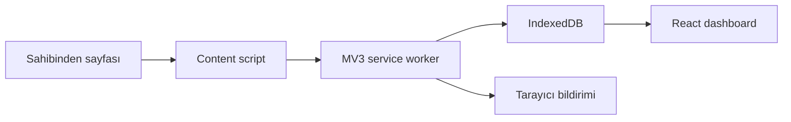

# Favori Radar Mimarisi

## Hedef

Sahibinden hesabının şifresini almadan, kullanıcının açık tarayıcı oturumunda
gördüğü favori ilanları ve fiyat gözlemlerini cihaz üzerinde saklamak.

## İlkeler

- Ücretsiz: zorunlu sunucu, SaaS veya ücretli API yok.
- Hafif: React dışında çalışma zamanı UI/veri kütüphanesi yok.
- Gizli: kullanıcı adı, şifre ve oturum çerezi uygulama verisine yazılmaz.
- Kontrollü: CAPTCHA aşılmaz; agresif tarama veya paralel istek yapılmaz.
- Yerel öncelikli: tüm ilanlar ve fiyat geçmişi IndexedDB içinde tutulur.

## Bileşenler

### Content script

Yalnızca kullanıcının tarayıcıda ziyaret ettiği uygun sayfalardan görünür ilan
verisini çıkarır. Siteye giriş yapmaz ve çerezleri okumaz.

### Service worker

Mesajları doğrular, gözlemleri kaydeder ve ileride fiyat düşüş bildirimlerini
yönetir. Manifest V3 gereği sürekli çalışan bir arka plan süreci değildir.

### IndexedDB

`listings` mağazası ilanların son durumunu, `prices` mağazası zaman serisini
tutar. Fiyat geçmişi eklemeli yapıdadır; böylece değişimler kaybolmaz.

### Dashboard

Yerel veriyi listeler, filtreler ve fiyat geçmişini gösterir. Grafik ilk
sürümde SVG ile çizileceği için grafik kütüphanesi gerektirmez.

## Veri Akışı

1. Kullanıcı favoriler sayfasını normal biçimde açar.
2. Content script görünür ilanları normalize eder.
3. Service worker ilanı günceller ve fiyat gözlemi ekler.
4. Önceki gözlemle karşılaştırılan fiyat değişimi yerelde hesaplanır.
5. Düşüş varsa tarayıcı bildirimi üretilebilir.
6. Dashboard IndexedDB üzerinden güncel görünümü oluşturur.

## Sınırlar

Tarayıcı eklentileri kapalıyken düzenli arka plan taraması garanti edilemez.
Tam otomatik 7/24 takip daha sonra isteğe bağlı bir yerel masaüstü yardımcı
süreci gerektirir. İlk sürüm bunu bilinçli olarak kapsam dışı bırakır.

## Sonraki Uygulama Sırası

1. Gerçek favoriler sayfası DOM adaptörü
2. Veri doğrulama ve yinelenen fiyat gözlemlerini önleme
3. Fiyat değişimi tablosu ve SVG grafik
4. Bildirim eşikleri
5. CSV/JSON dışa ve içe aktarma
6. Kaldırılan ilan durumunun güvenli biçimde tespiti
